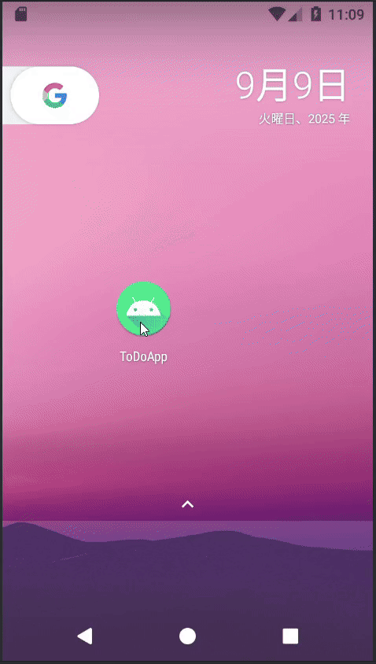

# TodoApp

Android向けのシンプルなタスク管理アプリです。

---

## 主な機能

- テキストを入力して「追加」ボタンを押すとタスクを追加
- タスクリストを**長押し**で、そのタスクを個別に削除
- アクションバーの削除ボタンで、全タスクを一括削除
- 入力されたタスクは **SQLite** に保存され、アプリ再起動後も保持

---

## デモ

---

## 使用技術

- **言語**: Java  
- **開発環境**: Android Studio  
- **SDK**: Android SDK (API Level 25)  
- **データベース**: SQLite（ローカルデータ保存）  
- **バージョン管理**: Git / GitHub

> 古いAPIレベル（25：Android 7.1）に対応。今後、対応バージョンの更新も検討しています。

---

## 参考文献

- 斎藤新三.Androidアプリ開発の教科書ー基礎＆応用力をしっかり育成！:Java対応ー第３版,翔泳社,2023.
